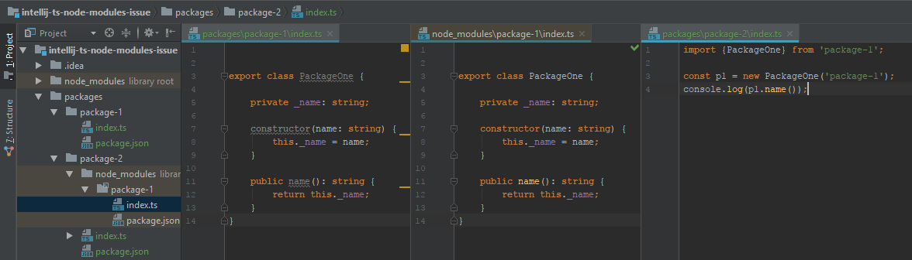

# IntelliJ-ts-node-modules-issue

Demo of an issue in IntelliJ/Webstorm where TS symlinked files are shown as not used. 

`PackageOne` has been imported in package-2, but only shows `PackageOne` as being used in 
`package-2\node_modules\package-1\index.ts`

As a result, refactoring/renaming anything in `packages-1` won't update usages in `package-2`

This setup is common when using [lerna](https://github.com/lerna/lerna) to manage mono repos of npm packages. 